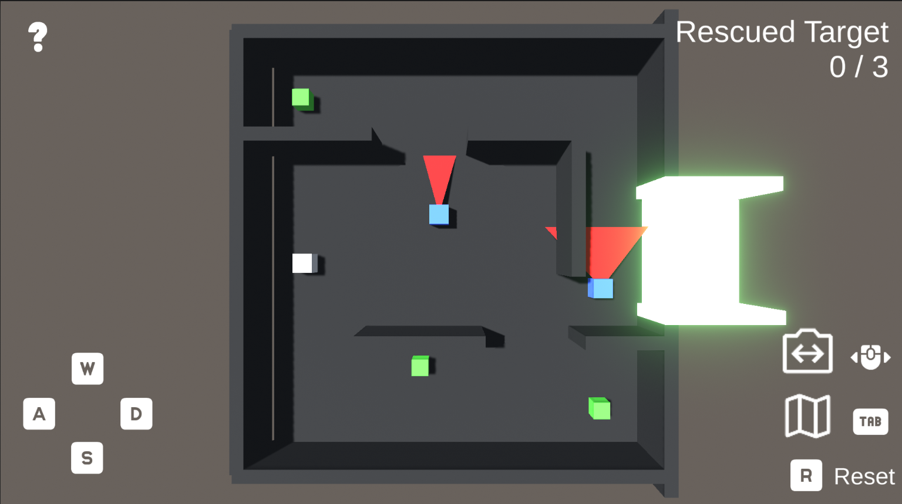
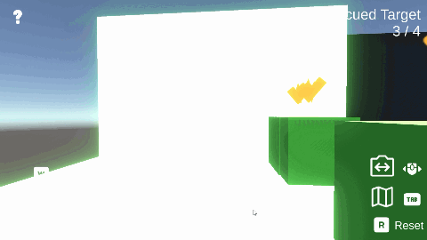

# RescueMaze
敵AIの視野を避けながら、迷路内にいる救出対象をゴールまで導く一人称視点のアクションゲームです。

## 概要
プレイヤーは敵が徘徊する迷路を探索し、迷っている救出対象をすべて見つけてゴールまで導きます。

敵には視野角と視野距離が設定されており、プレイヤーを発見すると追跡を開始します。また、敵が救出対象に接触すると、救出対象は初期位置へ戻されます。

プレイヤーは一人称視点と上空カメラを切り替えながら、敵の視野を避けて迷路を攻略します。

以下のgifは、クリアアニメーションの様子です。
ゲーム全体のサイクルが完結するように作り込みました。

  

## 開発環境
- Windows 11
- Unity 6.3
- C#
- Blender（タイトル画面制作）

## 操作方法
| 操作 | 内容 |
|------|------|
| WASD | 移動 |
| マウス | 一人称視点の操作 |
| Tab | 一人称視点／上空カメラ切り替え |
| R | ステージリスタート |
| Space | ステージクリア後に次のステージへ |
| Esc | タイトル画面でゲーム終了 |

## 実装した機能
- 敵AI（視野判定・追跡）
- 一人称視点／上空カメラ切り替え
- 救出対象の追従システム
- 説明用UI
- タイトル画面

## 工夫した点
- 敵ごとに視野角・視野距離を設定し、壁を挟まない場合のみプレイヤーを検知する視野判定を実装しました。
- カメラの向きを基準としたプレイヤー操作を実装しました。
- 救出対象がプレイヤーと重ならないよう追従位置を調整し、複数の救出対象にも対応できるようオフセットを設定しました。
- タイトル画面では背景のアニメーションと環境音を組み合わせ、ゲームの雰囲気を演出しました。

## 今後の改善点
- 敵の巡回パターンを増やし、ゲーム性を向上させる。
- 敵とプレイヤーの当たり判定を調整し、操作性を改善する。
- 救出対象の衝突判定を改善し、壁をすり抜けないようにする。

## 動画
[https://youtu.be/VWtFZuNf9bs](https://youtu.be/VWtFZuNf9bs)

## 作者
芳野 愛和

